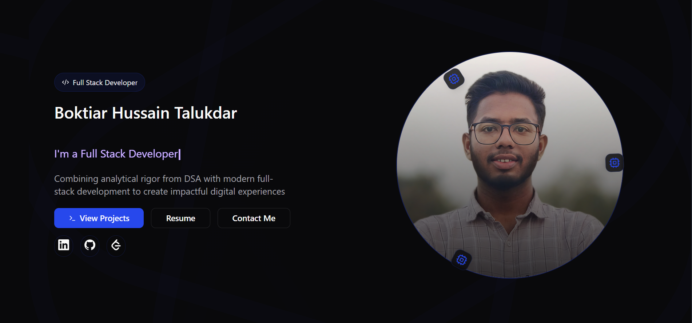

This is the repository for my personal portfolio website, a place where I showcase my skills, projects, and my journey as a passionate full-stack developer. I've built this website with modern web technologies to create a dynamic, engaging, and seamless user experience.

## 🚀 Live Demo

Check out the live version of my portfolio here: **[portfolio-boktiars-projects.vercel.app](https://portfolio-boktiars-projects.vercel.app/)**

## ✨ Features

* **Mesmerizing Animations:** An engaging introduction with a typewriter effect and animated visuals.
* **About Me:** A brief overview of my background and journey into the world of technology.
* **Skills Showcase:** A comprehensive list of my technical skills, categorized for clarity.
* **Project Gallery:** A filterable and searchable gallery of my projects, each with a detailed description, tech stack, and links to the live demo and source code.
* **Contact Form:** A functional contact form for reaching out to me directly, with form validation.
* **Responsive Design:** Fully responsive layout that looks great on all devices, from mobile phones to desktop computers.
* **Dark Mode:** A theme toggle to switch between light and dark modes.

## 🛠️ Technologies Used

This portfolio is built with a modern, full-stack technology stack:

* **Frontend:**
   <br><br>
     &nbsp;&nbsp;&nbsp;&nbsp;&nbsp; &nbsp;&nbsp;&nbsp;&nbsp;&nbsp;  &nbsp;&nbsp;&nbsp;&nbsp;&nbsp; &nbsp;&nbsp;&nbsp;&nbsp;&nbsp; 
      &nbsp;&nbsp;&nbsp;&nbsp;&nbsp; &nbsp;&nbsp;&nbsp;&nbsp;&nbsp; 
      &nbsp;&nbsp;&nbsp;&nbsp;&nbsp; &nbsp;&nbsp;&nbsp;&nbsp;&nbsp; 
      &nbsp;&nbsp;&nbsp;&nbsp;&nbsp; &nbsp;&nbsp;&nbsp;&nbsp;&nbsp; 
* **Deployment:**
     <br><br>
     &nbsp;&nbsp;&nbsp;&nbsp;&nbsp; &nbsp;&nbsp;&nbsp;&nbsp;&nbsp; 
     

## 🚀 Getting Started 

To get a local copy up and running, follow these simple steps.

### Prerequisites

* Node.js (v18 or later) 
* npm or yarn

### Installation

1.  Clone the repo
    ```sh
    git clone https://github.com/BHSajuu/Portfolio.git
    ```
2.  Install NPM packages
    ```sh
    npm install
    ```
3.  Start the development server
    ```sh
    npm run dev
    ``` 

The application will be available at `http://localhost:5173`


## 📧 Contact 

Boktiar Hussain Talukdar - [boktiaroff01@gmail.com](mailto:boktiaroff01@gmail.com)

